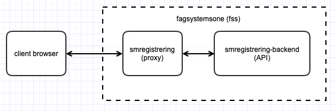

# Manuell registrering av papirsykmelding 🧾

Frontend-applikasjon for manuell registrering av sykmeldinger som ankommer på papir og blir tolket via skanning.


## Demo-side er tilgjengelig på:

https://smregistrering.labs.nais.io/

## Utvikling

Klon repo

```bash
$ git clone https://github.com/navikt/smregistrering.git
```

Installer avhengigheter

```bash
$ cd client
$ npm install
```

### Start local development-server

Running the following command will load the file `.env.development` as environment variables

```bash
$ npm start # Starts development server
```

### Ende-til-ende-tester med [Cypress](https://www.cypress.io)

Running all integration test from the command line:

```bash
$ npm run test-integration
```

Starting the cypress desktop application, where you can choose which tests to run:

```bash
$ NODE_ENV=test npm start & npx wait-on http://localhost:4321 && npx cypress open
```

Eventuelt kan man kjøre `$ NODE_ENV=test npm start` og `$ npx cypress open` i to separate terminalvinduer.

### Testing in the development environment

The application can be accessed at https://smregistrering.dev.adeo.no/?oppgaveid={oppgaveid} locally through `naisdevice`, or by logging in to utviklerimage.
